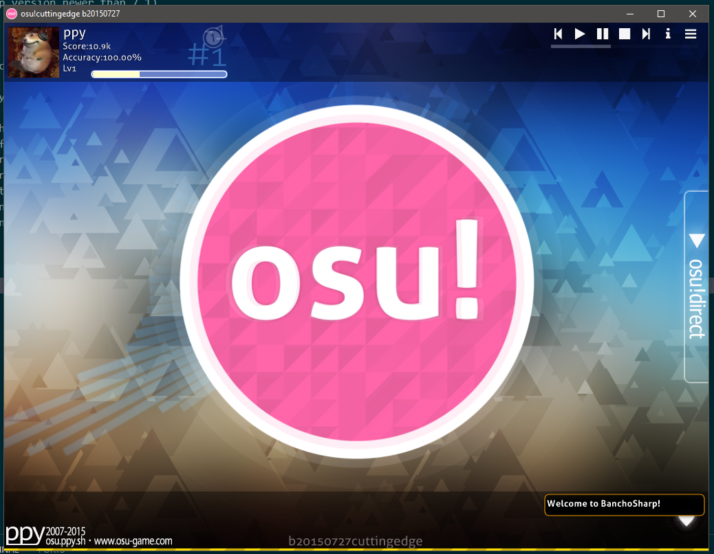

# W.I.P Bancho emulator written in C#, designed for clients from Late 2013 to Early 2016


## To setup server you need
- Dotnet 8.0 SDK
- MariaDB/MySQL
- PHP
- COMPOSER
- NGINX(we gonna use it as reverse proxy)
## How to setup
before proceding check if you have everything installed mentioned in Line 5
1. Change server domain in config.cs if you're not hosting it locally
2. Compile BanchoSharp
3. Replace your nginx config/edit you current acording to my config
4. reload/start nginx
5. replace SQL credentials in db.php
6. import db schema from frontend folder to your database that you provided in db.php
7. execute composer install in frontend directory
8. start PHP server at port 3000(or other if you changed it in nginx config)
9. start bancho server & avatar server
10. connect with any osu client that doesn't use ssl(Late 2013-Late 2015)
<br/>
ps: i don't recommend using this unless you have basic experience with: C#, PHP and MYSQL
<br/>
ps2: the db related things relay on basically PHP server for ex. score submitting, leaderboards and logging in

## Whats done
```
Logging in
leaderboards
score submiting
basic avatar server
basic c.ppy.sh page
```

## Whats not working
```
server stability
```
